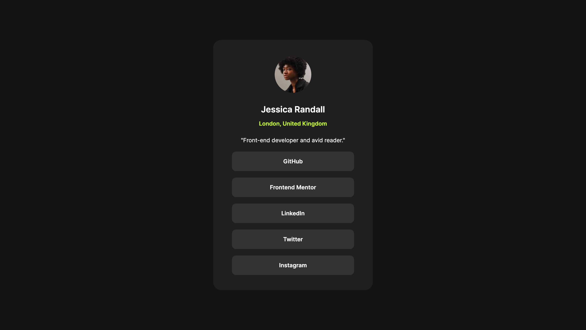

# Frontend Mentor - Social links profile solution

This is a solution to the [Social links profile challenge on Frontend Mentor](https://www.frontendmentor.io/challenges/social-links-profile-UG32l9m6dQ). Frontend Mentor challenges help you improve your coding skills by building realistic projects. 

## Table of contents

- [Overview](#overview)
  - [The challenge](#the-challenge)
  - [Screenshot](#screenshot)
  - [Links](#links)
- [My process](#my-process)
  - [Built with](#built-with)
  - [What I learned](#what-i-learned)
  - [Continued development](#continued-development)
  - [Useful resources](#useful-resources)
- [Author](#author)


## Overview

### The challenge

Users should be able to:

- See hover and focus states for all interactive elements on the page

### Screenshot



### Links

- Solution URL: [Add solution URL here](https://github.com/lij110397/social-links-profile)
- Live Site URL: [Add live site URL here](https://lij110397.github.io/social-links-profile/)

## My process

### Built with

- Semantic HTML5 markup
- CSS custom properties
- Flexbox
- CSS Grid
- Mobile-first workflow


### What I learned
**1. More familiar with building html and css files in the following process:**
- Setup Github remote and local repository
```
echo "# git-test" >> README.md
git init
git add README.md
git commit -m "first commit"
git branch -M main
git remote add origin https://github.com/<username>/git-test.git
git push -u origin main
```
- Check design files and list all elements included
- Completed html files which includes all listed elements
- Completed style file in order of root color, font import, global color and font, size and layout
- Make css more responsive by using "rem/em" unit, flex/grid layout
- Check the website in browser starting from mobile size; adjust according to the screen scale
- Check whether it meets WCAG standards
- Upload to Github and Github Page
- Edit README.md file
- Upload README.md file and submit

**2. How to place the element in the middle of its parent container**
```css
  body{
	    width: 100vw;
	    display: flex;
	    justify-content: center;
	    align-items: center;
    }
```
==if this is not working, add following code==
```css
    main {
	    /* Place main in the middle of body*/
	    position: absolute;
	    top: 50%;
	    left: 50%;
	    transform: translate(-50%, -50%);
    }
```

### Continued development
**About margin management?**
In the previous task, I found margin management confusing. In this task, I only used margin-bottom attribute instead of setting all different paddings and margins.
- What is good about this way?
If I need to change the margin between two elements, I don't need to change both of the margin. I just need to change one margin-bottom to adjust the marin.
The css file will be more neat and controllable.
- About margin collapse
Margin collapse should be avoided usually as it may cause unexpected collapse and unexpected layout.
According to most of lessons, it occurs between block elements in the same level or between the last element and its parent element. However, in reality, I just never see margin collapse happens?


### Useful resources

## Author

- Website - [Jiao Li]
